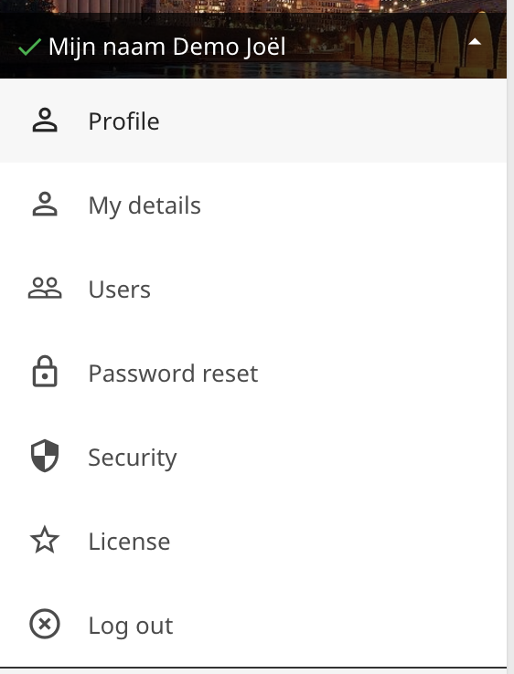

# Adding new users

You can add new users to your account with multiple roles for example your webmaster or your accountant.
To add a new user follow the next few steps:

Click on your name and select the users menu option

